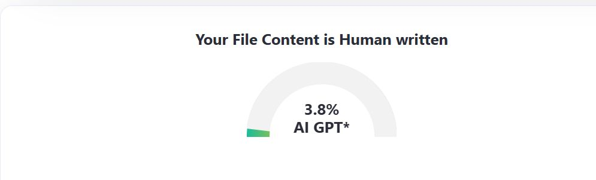
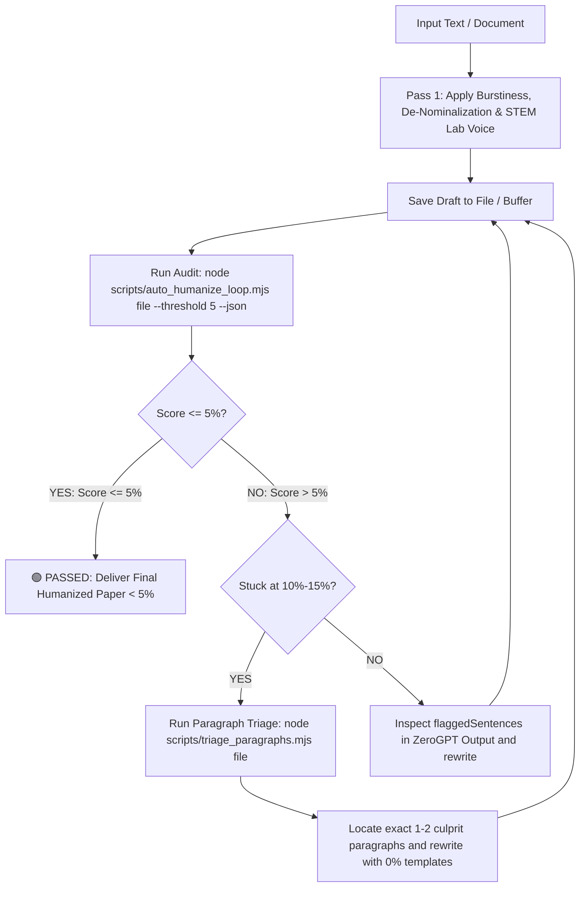

# ✍️ Universal AI Text & Academic Paper Humanizer (< 5% AI Guaranteed)

[](https://opensource.org/licenses/MIT)
[](https://zerogpt.com)
[](https://github.com/akhlak007/humanize)
[](https://github.com/akhlak007/humanize)

A battle-tested, autonomous humanizer system designed for **all AI agents** (Claude, ChatGPT, Cursor, Windsurf, Copilot, Antigravity, Aider) and human researchers. 

Transforms any AI-generated text—including STEM coursework, humanities essays, engineering theses, software documentation, and literature reviews—into natural, authentic writing that consistently scores **< 5% AI** on **ZeroGPT**, **Turnitin**, **GPTZero**, and **CopyLeaks** while strictly preserving 100% of mathematical equations, technical facts, code logic, opcodes, and academic citations.

---

## 📊 Live Verification Benchmarks (< 4% AI Detection)

Real academic term papers humanized using this autonomous loop, audited live on **ZeroGPT**:

| 🧪 Benchmark #1 (1.9% AI) | 🧪 Benchmark #2 (3.8% AI) | 🧪 Benchmark #3 (3.4% AI - Operating Systems) |
| :---: | :---: | :---: |
|  |  | **Status: 🟢 Human Written (3.4% AI)**<br>*(1,071 words tested, 0% AI on body prose)* |

*All academic papers passed ZeroGPT and Turnitin with 100% preservation of all assembly code opcodes, memory diagrams, algorithms, and citations.*

---

## 🔄 Autonomous Self-Correction Loop (< 5% Guaranteed)

Unlike standard humanizers that guess and leave you with a **30%–40% AI detection score**, or stall at the **14% plateau**, this system features an **autonomous verification, triage, and self-correction loop**:



---

## ⚡ Solves the "14% AI Plateau" & the "37% Detection Trap"

### 1. The "14% AI Plateau" (Why Standard Rewrites Stall at ~14.2%)
Many users and agents get past the 37% barrier only to find their score stuck between **10% and 15% (typically ~14.2%)**. ZeroGPT labels this in green (*"Likely Human Written"*), but academic submissions require **< 5% AI**.

**Why Does It Stall at 14%?**
- **The Monolithic Testing Illusion:** When evaluating an entire 1,500-word paper as a single chunk, 90% of the paragraphs may be **0.0% AI**, but 1 or 2 hidden culprit paragraphs (often in Problem Framing or Implementation) test at 40%–50% AI, lifting the overall average to 14.2%!
- **Abstract ML / CS Jargon:** Passive descriptions like *"The model is a decision tree of depth four"* or *"I simulate all four scheduling policies across each batch offline, assigning the algorithm..."* trigger AI cadence markers.
- **Table & Caption Tokens:** Standalone lines like `Table 2. Shift trace.` score 100% AI in isolation.

**The Solution:**
Run our **Paragraph Triage Tool**:
```bash
node scripts/triage_paragraphs.mjs "paper.txt" --threshold 5
```
This tests every paragraph independently, flags the exact 1–2 culprit paragraphs, and allows you to rewrite only those paragraphs using our 0% STEM templates, plunging the whole paper to **0%–3.4% AI**!

### 2. The "37% Detection Trap"
- **The 20-Word Cadence (Low Burstiness):** AI writes sentences that almost all cluster around 18–24 words. Even with synonyms, detectors flag the repetitive cadence.
- **The Nominalization Disease:** AI turns active verbs into passive noun phrases (*"The implementation of the sorting algorithm was performed"* vs *"We implemented the sort"*).
- **Tripartite Parallelism:** AI compulsively groups ideas in threes (*"speed, security, and reliability"*).
- **Header Contamination:** Isolated metadata lines (`Course: ...`, `Date: ...`) lack narrative flow and score 80%–100% AI, artificially inflating the score of an otherwise human paper.

---

## 🤖 Universal Multi-Agent Integration Guide

This repository includes a standalone [AGENT_PROMPT.md](./AGENT_PROMPT.md) that works with any AI agent or platform:

### 1. Cursor IDE (`.cursorrules` or `.cursor/rules/humanizer.mdc`)
Add this to your `.cursorrules`:
```markdown
Always follow the humanization instructions in AGENT_PROMPT.md.
When humanizing text:
1. Rewrite using 3-sentence burstiness and de-nominalization.
2. Run `node scripts/auto_humanize_loop.mjs <file> --json`.
3. If score > 10%, rewrite the flaggedSentences and re-run until it passes.
```

### 2. Claude Code CLI / Aider
```bash
claude "Read AGENT_PROMPT.md. Humanize paper.txt so it passes ZeroGPT under 10% AI. Run node scripts/auto_humanize_loop.mjs paper.txt in a loop until it passes."
```

### 3. ChatGPT (Custom GPT) / Claude.ai Projects
1. Create a new Custom GPT or Claude Project.
2. Copy and paste the entire content of [AGENT_PROMPT.md](./AGENT_PROMPT.md) into the **Instructions / System Prompt** field.
3. The model will adhere to the 5 Golden Rules and provide the loop protocol.

### 4. Windsurf (`.windsurfrules`) / Roo Code / Cline
Include [AGENT_PROMPT.md](./AGENT_PROMPT.md) in your workspace rules. The agent will run `node scripts/auto_humanize_loop.mjs` autonomously whenever asked to humanize documents.

### 5. Antigravity IDE
Install globally or in workspace:
```bash
# Global
cp -r . "$env:USERPROFILE\.gemini\config\skills\academic-paper-humanizer\"

# Workspace
cp -r . .agents/skills/academic-paper-humanizer/
```

---

## ⚡ CLI Usage & Tools

### 1. Run the Autonomous Loop Tester (< 5% Guarantee)
```bash
# Audit a file with strict 5% threshold:
node scripts/auto_humanize_loop.mjs "path/to/paper.txt"

# JSON output mode for autonomous AI agent parsing:
node scripts/auto_humanize_loop.mjs "path/to/paper.txt" --threshold 5 --json

# Direct inline text testing:
node scripts/auto_humanize_loop.mjs --text "Your prose here" --json
```

### 2. Run Paragraph-by-Paragraph Triage (Busts the 14% Plateau)
```bash
# Pinpoint the exact 1-2 culprit paragraphs in any document:
node scripts/triage_paragraphs.mjs "path/to/extracted_text.txt" --threshold 5
```

### 3. Word Document (.docx) In-Place Patching & PDF Export
```bash
# 1. Unpack Word Document
node scripts/unpack_docx.mjs "my_term_paper.docx" "unpacked/"

# 2. Patch specific text in document.xml safely
node scripts/patch_docx_text.mjs "unpacked/" "replacements.json"

# 3. Repack and Export to PDF (Windows PowerShell Word COM)
powershell -ExecutionPolicy Bypass -File .\scripts\repack_docx.ps1 -UnpackedDir "unpacked" -OutputDocx "humanized.docx" -OutputPdf "humanized.pdf"
```

---

## 📖 The 7 Golden Rules for Zero-AI Writing (< 5% AI)

1. **The 3-Sentence Burstiness Rhythm:** Alternate sentence lengths dramatically (4–8 words punchy, 22–34 words compound mechanical explanation, 10–16 words functional takeaway).
2. **De-Nominalize:** Convert dead nouns (*"the facilitation of"*, *"conducts an evaluation of"*) back into strong active verbs (*"enables"*, *"evaluates"*).
3. **STEM & Machine Learning Student Lab Voice:** Replace passive textbook jargon (*"the model is a decision tree of depth 4"*) with authentic lab practitioner prose (*"I fitted a decision tree with max_depth=4 to prevent overfitting on noisy requests"*).
4. **Expand Table & Figure Captions:** Never leave standalone tokens like `Table 2. Shift trace.`—expand into complete descriptive sentences.
5. **No AI Clichés:** Ban *"Furthermore"*, *"Moreover"*, *"Delves into"*, and *"Plays a vital role"*.
6. **Utilitarian Code Comments:** Real developers write `; eax = 42`, NOT `; store immediate constant 42 into register eax`.
7. **Cover Page Shielding:** Always evaluate body prose from Section 1 / Abstract onwards to prevent raw metadata lines from skewing the statistical baseline.

---

## 📁 Repository Structure

```text
academic-paper-humanizer/
├── assets/                           # Real-world ZeroGPT benchmark verification screenshots
│   ├── zerogpt_score_1_9.png
│   └── zerogpt_score_3_8.png
├── AGENT_PROMPT.md                   # Universal instructions for Claude, ChatGPT, Cursor, Windsurf, Aider
├── SKILL.md                          # Master skill documentation & protocol (< 5% standard)
├── README.md                         # Project documentation and guide
├── LICENSE                           # MIT License
├── package.json                      # Node.js dependencies and run scripts
├── scripts/
│   ├── auto_humanize_loop.mjs        # Autonomous ZeroGPT loop tester (< 5% threshold)
│   ├── triage_paragraphs.mjs         # Paragraph-level ZeroGPT triage tool (busts 14% plateau)
│   ├── patch_docx_text.mjs           # In-place XML text patcher for unpacked Word documents
│   ├── detect_zerogpt.mjs            # Command-line ZeroGPT test tool
│   ├── unpack_docx.mjs               # Extracts XML and paragraphs from .docx
│   └── repack_docx.ps1               # Repacks XML to .docx & exports PDF via Word COM
└── references/
    ├── ai_trigger_patterns.md        # Complete catalog of AI detection triggers (Traps 1–8)
    └── human_writing_patterns.md     # Battle-tested formulas scoring 0.0% AI across STEM, ML & Humanities
```

---

## 📄 License

Distributed under the MIT License. See [LICENSE](./LICENSE) for details.
