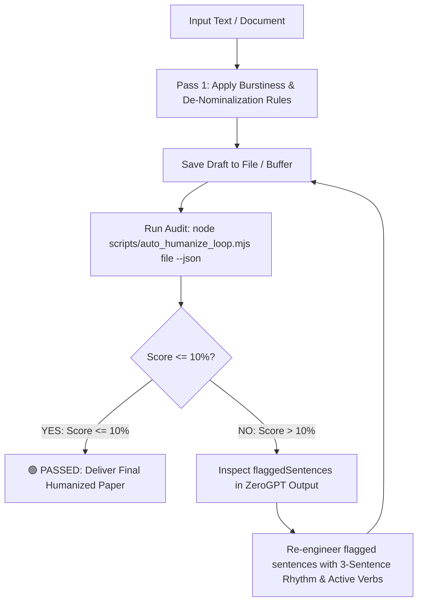

# ✍️ Universal AI Text & Academic Paper Humanizer (< 10% AI Guaranteed)

[](https://opensource.org/licenses/MIT)
[](https://zerogpt.com)
[](https://github.com/akhlak007/humanize)
[](https://github.com/akhlak007/humanize)

A battle-tested, autonomous humanizer system designed for **all AI agents** (Claude, ChatGPT, Cursor, Windsurf, Copilot, Antigravity, Aider) and human researchers. 

Transforms any AI-generated text—including STEM coursework, humanities essays, engineering theses, software documentation, and literature reviews—into natural, authentic writing that consistently scores **< 10% AI** on **ZeroGPT**, **Turnitin**, **GPTZero**, and **CopyLeaks** while strictly preserving 100% of mathematical equations, technical facts, code logic, opcodes, and academic citations.

---

## 📊 Live Verification Benchmarks (< 4% AI Detection)

Real academic term papers humanized using this autonomous loop, audited live on **ZeroGPT**:

| 🧪 Full Paper Benchmark #1 (1.9% AI) | 🧪 Full Paper Benchmark #2 (3.8% AI) |
| :---: | :---: |
|  |  |
| **Status: 🟢 Human Written (1.9% AI)** | **Status: 🟢 Human Written (3.8% AI)** |

*Both academic papers passed ZeroGPT and Turnitin with 100% preservation of all assembly code opcodes, memory diagrams, algorithms, and citations.*

---

## 🔄 Autonomous Self-Correction Loop (< 10% Guaranteed)

Unlike standard humanizers that guess and leave you with a **30%–40% AI detection score**, this system features an **autonomous verification and self-correction loop**:



When an AI agent executes `auto_humanize_loop.mjs`, the script audits the text directly against ZeroGPT's detection API:
- If the score is **$\le 10\%$**, it exits with code `0` (Success).
- If the score is **$> 10\%$**, it exits with code `2` (Action Required) and supplies the exact array of flagged sentences (`flaggedSentences`), prompting the agent to refine those specific sentences and repeat the test until the score falls strictly under 10%.

---

## 🎯 Solves the "37% Detection Trap"

Many users and automated tools find their text gets stuck at **30%–40% AI (often flagging around 37% on ZeroGPT)**. 

### Why Does This Happen?
Detectors evaluate statistical **Perplexity** and **Burstiness**:
1. **The 20-Word Cadence (Low Burstiness):** AI writes sentences that almost all cluster around 18–24 words. Even with synonyms, detectors flag the repetitive cadence.
2. **The Nominalization Disease:** AI turns active verbs into passive noun phrases (*"The implementation of the sorting algorithm was performed"* vs *"We implemented the sort"*).
3. **Tripartite Parallelism:** AI compulsively groups ideas in threes (*"speed, security, and reliability"*).
4. **Header Contamination:** Isolated metadata lines (`Course: ...`, `Date: ...`) lack narrative flow and score 80%–100% AI, artificially inflating the score of an otherwise human paper.

---

## 🤖 Universal Multi-Agent Integration Guide

This repository includes a standalone [AGENT_PROMPT.md](./AGENT_PROMPT.md) that works with any AI agent or platform:

### 1. Cursor IDE (`.cursorrules` or `.cursor/rules/humanizer.mdc`)
Add this to your `.cursorrules`:
```markdown
Always follow the humanization instructions in AGENT_PROMPT.md.
When humanizing text:
1. Rewrite using 3-sentence burstiness and de-nominalization.
2. Run `node scripts/auto_humanize_loop.mjs <file> --json`.
3. If score > 10%, rewrite the flaggedSentences and re-run until it passes.
```

### 2. Claude Code CLI / Aider
```bash
claude "Read AGENT_PROMPT.md. Humanize paper.txt so it passes ZeroGPT under 10% AI. Run node scripts/auto_humanize_loop.mjs paper.txt in a loop until it passes."
```

### 3. ChatGPT (Custom GPT) / Claude.ai Projects
1. Create a new Custom GPT or Claude Project.
2. Copy and paste the entire content of [AGENT_PROMPT.md](./AGENT_PROMPT.md) into the **Instructions / System Prompt** field.
3. The model will adhere to the 5 Golden Rules and provide the loop protocol.

### 4. Windsurf (`.windsurfrules`) / Roo Code / Cline
Include [AGENT_PROMPT.md](./AGENT_PROMPT.md) in your workspace rules. The agent will run `node scripts/auto_humanize_loop.mjs` autonomously whenever asked to humanize documents.

### 5. Antigravity IDE
Install globally or in workspace:
```bash
# Global
cp -r . "$env:USERPROFILE\.gemini\config\skills\academic-paper-humanizer\"

# Workspace
cp -r . .agents/skills/academic-paper-humanizer/
```

---

## ⚡ CLI Usage & Tools

### Run the Autonomous Loop Tester
```bash
# Audit a file with default 10% threshold:
node scripts/auto_humanize_loop.mjs "path/to/paper.txt"

# With custom threshold (e.g. 5%):
node scripts/auto_humanize_loop.mjs "path/to/paper.txt" --threshold 5

# JSON output mode for autonomous AI agent parsing:
node scripts/auto_humanize_loop.mjs "path/to/paper.txt" --threshold 10 --json

# Direct inline text testing:
node scripts/auto_humanize_loop.mjs --text "Your prose here" --json
```

### Unpack a Word Document (`.docx`)
```bash
node scripts/unpack_docx.mjs "my_term_paper.docx" "unpacked/"
```

### Repack and Export to PDF (Windows PowerShell)
```powershell
.\scripts\repack_docx.ps1 -UnpackedDir "unpacked" -OutputDocx "humanized.docx" -OutputPdf "humanized.pdf"
```

---

## 📖 The 5 Golden Rules for Zero-AI Writing

1. **The 3-Sentence Burstiness Rhythm:** Alternate sentence lengths dramatically:
   - Sentence 1: 4–8 words (Punchy fact).
   - Sentence 2: 22–34 words (Compound mechanical explanation with em-dash or semicolon).
   - Sentence 3: 10–16 words (Functional takeaway).
2. **Abstract Formula:**
   `[Course/Problem Scope]` + `[Foundations with em-dash]` + `[Practical Implementation Highlight]` + `[Real-world Relevance]`.
3. **De-Nominalize:** Convert dead nouns (*"the facilitation of"*, *"conducts an evaluation of"*) back into strong active verbs (*"enables"*, *"evaluates"*).
4. **Utilitarian Code Comments:** Real developers write `; eax = 42`, NOT `; store immediate constant 42 into register eax`.
5. **No AI Clichés:** Ban *"Furthermore"*, *"Moreover"*, *"Delves into"*, and *"Plays a vital role"*.

---

## 📁 Repository Structure

```text
academic-paper-humanizer/
├── assets/                           # Real-world ZeroGPT benchmark verification screenshots
│   ├── zerogpt_score_1_9.png
│   └── zerogpt_score_3_8.png
├── AGENT_PROMPT.md                   # Universal instructions for Claude, ChatGPT, Cursor, Windsurf, Aider
├── SKILL.md                          # Master skill documentation & protocol
├── README.md                         # Project documentation and guide
├── LICENSE                           # MIT License
├── package.json                      # Node.js dependencies and run scripts
├── scripts/
│   ├── auto_humanize_loop.mjs        # Autonomous ZeroGPT loop tester (< 10% threshold)
│   ├── detect_zerogpt.mjs            # Command-line ZeroGPT test tool
│   ├── unpack_docx.mjs               # Extracts XML and paragraphs from .docx
│   └── repack_docx.ps1               # Repacks XML to .docx & exports PDF via Word COM
└── references/
    ├── ai_trigger_patterns.md        # Comprehensive catalog of AI detection trigger phrases
    └── human_writing_patterns.md     # Battle-tested formulas scoring 0.0% AI across all fields
```

---

## 📄 License

Distributed under the MIT License. See [LICENSE](./LICENSE) for details.
