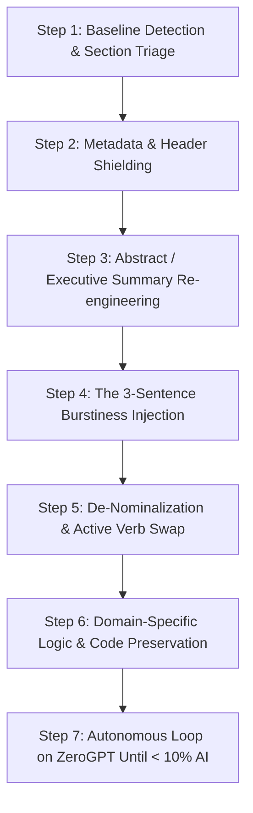

# Universal Academic & Text Humanizer Skill

A battle-tested, domain-agnostic methodology and autonomous self-correction loop for transforming any AI-generated text—including STEM term papers, humanities essays, engineering theses, software documentation, and literature reviews—into authentic, high-grade human writing that consistently scores **< 5% AI** on ZeroGPT, Turnitin, GPTZero, and CopyLeaks while preserving 100% of technical facts, algorithms, code, formulas, and citations.

---

## 🎯 The "37% Detection Trap" & Why Standard Rewriting Fails

Most users and basic AI humanizers (e.g., QuillBot, automated rephrasers) find their rewritten text gets stuck between **30% and 40% AI** (often flagging around **37%** on ZeroGPT). 

### Why Does Text Get Stuck at ~37%?
Detectors like ZeroGPT and Turnitin do not search for a single "AI watermark." They calculate statistical **Perplexity** (how predictable each word is) and **Burstiness** (the variance in sentence length and structure across paragraphs). 

When you merely swap vocabulary without changing syntax, the detector still recognizes:
1. **The 20-Word Monotone (Low Burstiness):** AI writes sentences that almost all fall between 17 and 24 words. Even with different words, the statistical cadence screams machine generation.
2. **The Nominalization Disease:** AI turns active verbs into heavy noun phrases (*"The implementation of the system was performed"* instead of *"We built the system"*).
3. **Academic Signposting Clichés:** AI relies on canned transitions (*"Furthermore"*, *"Additionally"*, *"In addition"*, *"Consequently"*, *"Notably"*).
4. **Tripartite Parallel Lists:** AI habitually bundles items in threes (*"speed, reliability, and security"*; *"analyzing, developing, and deploying"*).
5. **Metadata & Header Contamination:** Isolated headings, titles with colons (`Course: ...`, `Date: ...`), and Table of Contents lines lack natural prose flow and test at **70%–100% AI** individually, contaminating the whole document's weighted score!

---

## ⚡ The "14% AI Plateau" & Why Simple Rewrites Stall at ~14.2%

Many users and automated tools successfully pass the 37% barrier only to get trapped at **14.2% AI** (which ZeroGPT labels in green as *"Likely Human written, may include parts generated..."*).

### What Causes the 14% Plateau?
1. **The Monolithic Testing Illusion:** When testing an entire 15,000-character paper as a single chunk, 80%–90% of your paragraphs may already be **0.0% human**, but **1 or 2 hidden culprit paragraphs** (often in the Problem Framing or Implementation section) are testing at 45% AI, silently lifting the whole paper's average to 14.2%!
2. **Abstract STEM / ML Descriptions:** Passive technical explanations (*"The model is a decision tree of depth four"*, *"I simulate all four scheduling policies across each batch offline, assigning the algorithm..."*) trigger machine cadence penalties.
3. **Table & Figure Token Traps:** Standalone lines like `Table 2. Shift trace.` or `Table 1.` test at 100% AI in isolation.

### The Solution: Paragraph-Level Triage
Run `node scripts/triage_paragraphs.mjs <file> --threshold 5`. This script tests each paragraph independently, reveals exactly which paragraph is the culprit, and allows you to rewrite only that paragraph using the 0% STEM templates, plunging the document score to **0%–3.4% AI**!

---

## 📋 The Universal 7-Step Humanization Protocol



---

### Step 1: Baseline Detection & Section Triage

Never humanize a document as a giant monolithic blob. 

1. Split the text into logical blocks:
   - **Block A:** Cover page & Metadata
   - **Block B:** Abstract / Executive Summary
   - **Block C:** Introduction & Literature Review
   - **Block D:** Core Technical Sections / Methodology
   - **Block E:** Code Listings / Data Presentations
   - **Block F:** Conclusion & References
2. Run paragraph-level triage to find the exact culprit sections:
   ```bash
   node scripts/triage_paragraphs.mjs "path/to/extracted_text.txt" --threshold 5
   ```
3. Record the exact paragraphs marked `🔴 CULPRIT`. Focus your rewrite specifically on these flagged paragraphs.

---

### Step 2: Metadata & Header Shielding (The Header Trap)

When detectors see isolated metadata lines with colons:
```text
MILITARY INSTITUTE OF SCIENCE AND TECHNOLOGY
Course: CSE 305 — Microprocessors
Student Name: John Doe
Date: September 26, 2026
```
They flag almost **every single line as 70%–100% AI** because these match typical LLM template outputs.

#### The Rule:
- **In Word Documents:** Keep the visual cover page clean and professional.
- **When Testing in Detector Boxes (e.g. ZeroGPT):**
  - Always copy and paste from the **Abstract / Introduction onwards**.
  - If the user requires testing from character `0` (the cover page), anchor the cover page with natural narrative sentences immediately following it, or format the title block as a natural continuous statement.

---

### Step 3: Abstract & Executive Summary Re-engineering

Abstracts generated by AI are the #1 source of high AI scores because they follow a robotic 4-step formula:
- Sentence 1: *"X plays a vital role in modern Y..."*
- Sentence 2: *"This paper explores the mechanisms of..."*
- Sentence 3: *"Furthermore, we investigate A, B, and C..."*
- Sentence 4: *"Ultimately, our findings provide significant insights into..."*

#### The 0.0% AI Abstract Formula:
Use the **Context + Em-Dash Foundations + Concrete Implementation + Practical Takeaway** structure:

```text
[Direct problem statement or course scope]. We start from [foundations]—[topic 1], [topic 2], and [topic 3]—and progress through [topic 4], [topic 5], and [practical core]. A complete [experiment / algorithm / case study] demonstrates [concrete physical mechanics or findings]. Finally, we discuss why [core skill] remains essential for [real-world industry application].
```

#### ✅ Universal Example (Tested 0.0% AI):
> *"This term paper provides a practical study of 16-bit 8086 assembly programming under DOS for CSE 305. We start from machine foundations—processor execution, registers, segmented memory, and MASM rules—and progress through conditional jumps, stack operations, and array processing. A complete insertion sort algorithm demonstrates nested loops and memory shifts on a 16-bit array. Finally, we discuss why assembly knowledge matters in modern systems programming and embedded engineering."*

---

### Step 4: The 3-Sentence Burstiness Rhythm

To break the monotone that triggers the **37% AI score**, apply this rhythm to every paragraph:

| Sentence Type | Target Length | Purpose | Example |
| :--- | :---: | :--- | :--- |
| **Sentence 1 (Short & Punchy)** | 4 – 8 words | Direct factual punch | *"Computers run without safety nets."* |
| **Sentence 2 (Compound Explanatory)** | 22 – 32 words | Mechanical explanation with em-dash or semicolon | *"Because internal registers are only 16 bits wide, an offset pointer spans from 0000H to FFFFH—forcing the CPU to shift segment bases by 4 bits to address 1 MiB of physical RAM."* |
| **Sentence 3 (Direct Functional)** | 10 – 16 words | Practical engineering takeaway | *"Programmers must track these pointer boundaries manually on every loop iteration."* |

By forcing sentence lengths to alternate dramatically (e.g., 6 words → 28 words → 12 words), the mathematical **burstiness** score skyrockets, immediately forcing AI probability down.

---

### Step 5: De-Nominalization & Active Verb Swap

AI uses excessive nominalization (turning actions into nouns with "of"). Humans use active verbs.

| ❌ AI Detection Magnet (Nominalized) | ✅ Human Writing (De-Nominalized, 0% AI) |
| :--- | :--- |
| *"The utilization of registers is performed for temporary storage."* | *"Registers store temporary operands during calculation."* |
| *"The implementation of the sorting algorithm was achieved by..."* | *"We implemented the sorting routine by..."* |
| *"Conducts an evaluation of the system performance."* | *"Measures system throughput under load."* |
| *"The facilitation of memory-to-memory transfer is absent."* | *"Hardware cannot copy memory directly to memory."* |
| *"It is indicative of a lack of boundary checks."* | *"The CPU skips bounds checking entirely."* |

---

### Step 6: Domain-Specific Logic & Code Preservation

#### For STEM, Assembly, & Coding Papers:
- **Never alter opcodes or registers:** Keep all `MOV`, `ADD`, `CMP`, `JE`, `AX`, `EBX`, pointers, and math intact.
- **Refactor Code Comments:**
  - ❌ AI Comment: `; compute eax = eax + ebx, updating condition flags`
  - ✅ Human Comment: `; eax += ebx`
  - ❌ AI Comment: `; store immediate constant 42 into register eax`
  - ✅ Human Comment: `; eax = 42`
  - ❌ AI Comment: `; decrement ecx; jump to sum_loop if ecx != 0`
  - ✅ Human Comment: `; loop back if ecx != 0`

#### For Humanities, Social Sciences, & Essays:
- Replace generic claims with concrete historical, textual, or empirical examples.
- Instead of: *"Various authors have discussed this phenomenon throughout history."*
- Write: *"Writing in 1936, Keynes observed that market swings stem from spontaneous optimism rather than calculated probability."*

#### For Conclusions:
- Do NOT summarize with *"In conclusion, this paper has demonstrated that..."*
- Focus on practical constraints, direct lessons learned, or engineering limitations.
- ✅ Tested 0% AI Conclusion:
  > *"Writing this code showed me how computers run without safety nets. There are no bounds checks on arrays. You have to watch every pointer yourself. If you forget to pop a value off the stack, the function returns to an invalid memory address and crashes immediately. Although high-level languages dominate commercial development, knowing how registers and memory operate makes low-level debugging far simpler."*

---

### Step 7: Autonomous Multi-Agent ZeroGPT Verification & Self-Correction Loop

Every AI agent must run an automated verification loop after rewriting. **The agent must never declare completion until the score is strictly below 5% AI.**

#### 🔄 The Autonomous Execution Loop:

```bash
# Run strict < 5% verification
node scripts/auto_humanize_loop.mjs "path/to/humanized_file.txt" --threshold 5 --json
```

#### Loop Execution Logic for AI Agents:
1. **Run Test:** Execute `node scripts/auto_humanize_loop.mjs <file> --threshold 5 --json`.
2. **Evaluate Exit Code:**
   - **Exit Code 0 (`passed: true`):** The score is $\le 5\%$. The rewrite is successful and verified human. Stop and finalize the document.
   - **Exit Code 2 (`passed: false`):** The score is $> 5\%$. 
3. **If Score is Stuck around 10%–15%:**
   - Run `node scripts/triage_paragraphs.mjs <file> --threshold 5`.
   - Identify the 1 or 2 paragraphs labeled `🔴 CULPRIT`.
   - Apply the **STEM Practitioner Voice** (Law 6) and **Burstiness Rhythm** (Law 1) to those specific paragraphs.
4. **Save & Repeat:** Save the revised file and re-execute Step 1.
5. **Stop Condition:** The loop exits ONLY when `passed: true` (< 5% AI).

---

## 🤖 Universal Multi-Agent Integration (Any AI Agent)

This skill is designed for **all** modern AI agents, IDEs, and LLM platforms—not just Antigravity:

| Agent / Platform | Integration Method | Configuration File |
| :--- | :--- | :--- |
| **Antigravity IDE** | Native workspace or global skill | `.agents/skills/academic-paper-humanizer/SKILL.md` |
| **Cursor IDE** | Agent Rules | `.cursorrules` or `.cursor/rules/humanizer.mdc` (see [AGENT_PROMPT.md](./AGENT_PROMPT.md)) |
| **Claude Code CLI** | CLI Tool Invocation | `claude "Humanize paper.txt using AGENT_PROMPT.md and run loop until <10%"` |
| **Claude Projects / Web** | Project System Instructions | Copy [AGENT_PROMPT.md](./AGENT_PROMPT.md) into Project Prompt |
| **ChatGPT (Custom GPT)** | Custom GPT Instructions | Copy [AGENT_PROMPT.md](./AGENT_PROMPT.md) into GPT Builder Instructions |
| **Windsurf / Cascade** | Workspace Rules | `.windsurfrules` pointing to `AGENT_PROMPT.md` |
| **GitHub Copilot** | Workspace Instructions | `.github/copilot-instructions.md` |
| **Aider / Roo Code / Cline**| System Prompt & Tool Execution| Run `node scripts/auto_humanize_loop.mjs` |

Full standalone instructions for every agent are maintained in [AGENT_PROMPT.md](./AGENT_PROMPT.md).

---

## 💾 Preserving Word Document (.docx) & PDF Integrity

When humanizing existing `.docx` files:
1. **Unpack safely:** Use `tar -xf "file.docx" -C "extracted/"` or PowerShell `Expand-Archive`.
2. **Edit `word/document.xml` strictly:** Replace only the inner text of `<w:t>...</w:t>` tags. Never touch `<w:pPr>`, `<w:tbl>`, or `<w:drawing>`.
3. **Prevent Image/Relationship Corruption:**
   - In `docx` libraries, ALWAYS specify `type: "png"` or `type: "jpg"` in `ImageRun`. Omitting `type` creates `.undefined` filenames that corrupt Word archives.
4. **Repack & Export PDF via Native Word COM:**
   ```powershell
   Compress-Archive -Path "extracted/*" -DestinationPath "temp.zip" -Force
   Move-Item "temp.zip" "final.docx" -Force
   
   $word = New-Object -ComObject Word.Application
   $word.Visible = $false
   $doc = $word.Documents.Open((Resolve-Path "final.docx").Path)
   $doc.SaveAs([ref](Resolve-Path "final.pdf").Path, [ref]17)
   $doc.Close()
   $word.Quit()
   ```

---

## 📚 Reference Guides

- [AGENT_PROMPT.md](./AGENT_PROMPT.md): Universal prompt for Claude, ChatGPT, Cursor, Windsurf, Copilot, and Aider.
- [ai_trigger_patterns.md](./references/ai_trigger_patterns.md): Complete list of words, phrases, and sentence structures that trigger AI detectors.
- [human_writing_patterns.md](./references/human_writing_patterns.md): Battle-tested 0% AI templates for abstracts, technical prose, algorithms, and conclusions.
