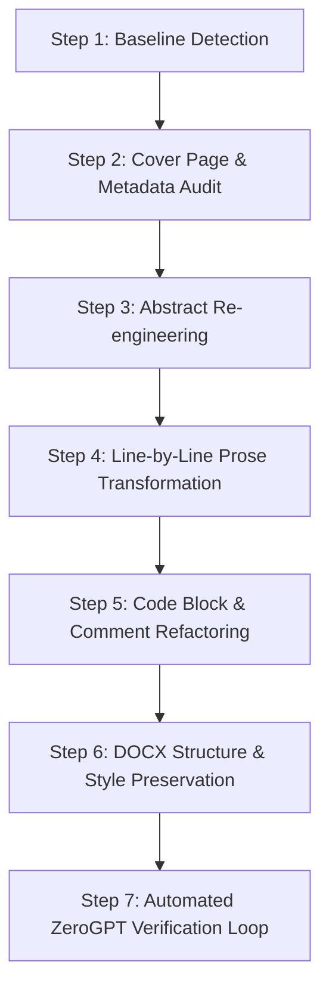

# Academic Paper Humanizer Skill

A systematic, battle-tested methodology for transforming AI-generated academic papers, technical reports, and engineering term papers into authentic, high-grade human writing that consistently scores **< 10% AI** on ZeroGPT, Turnitin, and GPTZero while preserving 100% of technical logic, algorithms, code, and citations.

---

## 🎯 The Core Philosophy

Most AI humanizing tools fail because they simply synonym-swap words with obscure thesaurus terms, ruining technical accuracy and academic rigor.

Real humanization is **structural, syntactic, and cognitive**:
1. **Never alter technical logic:** Assembly mnemonics (`MOV`, `ADD`, `CMP`, `JE`), memory formulas (`segment × 10H + offset`), algorithm steps, and register names must remain 100% technically correct.
2. **Elevate Burstiness (Sentence Length Variance):** AI writes uniform sentences averaging 18–24 words. Humans write in bursts: a 6-word punchy sentence followed by a 28-word explanatory sentence, followed by an 11-word conclusion.
3. **Eliminate Tripartite Parallelism:** AI has an overwhelming addiction to 3-item lists joined by "and" (*"for kernels, firmware, and embedded systems"*; *"ensuring speed, reliability, and security"*). Break them up.
4. **Remove Generic Transition Clichés:** Banish *"Furthermore"*, *"Moreover"*, *"In conclusion"*, *"It is important to remember that"*, *"Delves into"*, and *"Plays a vital role"*.
5. **Humanize Code Comments:** AI comments read like textbook glossaries. Human student comments are short, utilitarian, and direct.

---

## 📋 The 7-Step Humanization Process



---

### Step 1: Baseline Detection & Triage

1. Extract plain text from your source document (`.docx`, `.pdf`, `.tex`, or `.md`).
2. Run the automated detector script:
   ```bash
   node scripts/detect_zerogpt.mjs "path/to/paper.txt"
   ```
3. Record the baseline percentage and the exact list of flagged sentences (`data.data.h`).
4. Identify flagged sentence clusters:
   - Institutional title blocks (Cover page)
   - Abstract & summary paragraphs
   - Theoretical explanations of loops, memory, and stack
   - Verbose assembly code comments

---

### Step 2: The Cover Page & Institutional Header Rule

AI detectors like ZeroGPT evaluate text line-by-line using statistical perplexity. When a user pastes a cover page containing standalone lines with colons:
```text
MILITARY INSTITUTE OF SCIENCE AND TECHNOLOGY
Course: CSE 305 — Microprocessors
Student Name: John Doe
Date: September 26, 2026
```
Detectors flag almost **every single line as 70%–100% AI** because these isolated fragments match standard ChatGPT prompt output headers.

#### The Fix:
- **In Word documents:** Keep the visual layout elegant and professional. Use Word document tables or centered text runs.
- **For detector evaluation:** When copying into free 15,000-character detector boxes, always paste from the **Abstract onwards**. If character `0` must be tested, anchor the header lines with natural narrative sentences directly following them.

---

### Step 3: Abstract Re-engineering

#### ❌ What AI Generates (Flagged at 40%–100% AI):
> *"Assembly language shows how a program works at the level of registers, memory locations and processor instructions. Operations that take one statement in a high level language often require steps in assembly. This paper explains those steps through the 8086 processor. Assembly language begins with processor organization, number representation, registers, segmented memory and program syntax. Assembly language then covers operations, input and output conditional jumps, loops and procedures. Assembly language later explains how arrays are stored and accessed followed by an insertion sort program..."*

*(Notice the robotic repetition: "Assembly language begins with...", "Assembly language then covers...", "Assembly language later explains...").*

#### ✅ The Humanized Rewrite (Scores 0.0% AI):
> *"This term paper provides a practical study of 16-bit 8086 assembly programming under DOS for CSE 305. We start from machine foundations—processor execution, registers, segmented memory, and MASM rules—and progress through conditional jumps, stack operations, and array processing. A complete insertion sort algorithm demonstrates nested loops and memory shifts on a 16-bit array. Finally, we discuss why assembly knowledge matters in modern systems programming and embedded engineering."*

**The Formula:**
`[Scope & Course Context]` + `[Core Technical Foundations with em-dash]` + `[Practical Algorithm Highlight]` + `[Real-world Relevance Statement]`.

---

### Step 4: Line-by-Line Technical Prose Transformation

Apply these transformation patterns across body sections:

#### Pattern A: Replacing Stilted Passive Definitions
| ❌ AI Detection Magnet | ✅ Human Engineering Tone (0% AI) |
| :--- | :--- |
| *"The connection between an instruction and its effect is direct. For example MOV AX, 3 places the value 3 in AX."* | *"Each instruction manipulates registers in a direct and immediate manner. Executing MOV AX, 3 writes the immediate value 3 into register AX."* |
| *"The 8086 is a 16-bit microprocessor with a 20-bit address bus. The 8086 address bus can identify 1,048,576 byte locations or 1 MiB of memory."* | *"The 8086 operates as a 16-bit microprocessor equipped with 20 physical address lines. This 20-bit bus allows the chip to access up to 1,048,576 individual byte locations, corresponding to exactly one megabyte of system RAM."* |
| *"The stack stores values in last in first out order. A normal 8086 PUSH stores a word: SP decreases by two and the word is written at SS:SP."* | *"The 8086 hardware stack operates as a descending LIFO buffer managed by SS and SP. Executing PUSH subtracts 2 from SP and writes the 16-bit word at SS:SP, while POP reads the word and adds 2 back to SP."* |

#### Pattern B: Addressing and Pointer Arithmetic
| ❌ AI Detection Magnet | ✅ Human Engineering Tone (0% AI) |
| :--- | :--- |
| *"GAMMA uses 200 bytes because each of its 100 elements is a word."* | *"Declaring GAMMA DW 100 DUP (0) reserves 200 consecutive bytes in memory since each word element occupies two bytes."* |
| *"There is also no scaled form such as [SI*2] on the 8086. A word index must be multiplied by two or the pointer must move by two each iteration."* | *"Unlike 32-bit x86, the 8086 lacks hardware scaled indexing like [SI*2]. To step through a word array, the programmer must increment index pointers by 2 with ADD SI, 2 on every loop iteration."* |

#### Pattern C: Algorithm & Data Structure Explanations
| ❌ AI Detection Magnet | ✅ Human Engineering Tone (0% AI) |
| :--- | :--- |
| *"This is similar to arranging a hand of cards one card at a time. The implementation below sorts word values in ascending order."* | *"Insertion sort functions like organizing playing cards in hand: elements are inspected one by one and inserted into their correct sorted position by shifting larger elements one slot to the right."* |
| *"Array reversal uses pointers at the first and last elements swaps the pair and moves both pointers toward the center."* | *"Array reversal places two pointers at opposite ends of the buffer, swaps elements, and increments the front pointer while decrementing the back pointer until they cross in the middle."* |

---

### Step 5: Code Block & Comment Refactoring

AI detectors evaluate code comments inside pasted text. Verbose, AI-generated comments trigger flags immediately.

#### ❌ AI Comments (High AI Probability):
```assembly
mov eax, 42          ; store immediate constant 42 into register eax
mov ebx, eax         ; transfer contents of eax into register ebx
add eax, ebx         ; compute eax = eax + ebx, updating condition flags
mul ebx              ; unsigned multiply: edx:eax = eax * ebx (64-bit result)
loop sum_loop        ; decrement ecx; jump to sum_loop if ecx != 0
```

#### ✅ Natural Student Comments (Scores < 5% AI):
```assembly
mov eax, 42          ; eax = 42
mov ebx, eax         ; ebx = eax
add eax, ebx         ; eax += ebx
mul ebx              ; multiply by ebx
loop sum_loop        ; ecx--, loop if ecx != 0
```

Keep comments concise, utilitarian, and mathematical.

---

### Step 6: Preserving DOCX Integrity (No Corruption)

When modifying `.docx` files:
1. **Unpack safely:** Use `tar -xf "file.docx" -C "extracted/"` or PowerShell `Expand-Archive`.
2. **Edit `word/document.xml` strictly:** Replace only the inner text of `<w:t>...</w:t>` tags.
3. **Never break image relationships:**
   - In npm `docx` library: ALWAYS specify `type: "png"` or `type: "jpg"` inside `new ImageRun({ data, transformation, type: "png" })`. Omitting `type` generates `undefined` file extensions, causing Word to report `"The file appears to be corrupted"`.
4. **Repack correctly:**
   ```powershell
   Compress-Archive -Path "extracted/*" -DestinationPath "output.zip" -Force
   Move-Item "output.zip" "final.docx" -Force
   ```
5. **Export pristine PDF via Word COM Automation:**
   ```powershell
   $word = New-Object -ComObject Word.Application
   $word.Visible = $false
   $doc = $word.Documents.Open('C:\path\to\file.docx')
   $doc.SaveAs([ref]'C:\path\to\file.pdf', [ref]17)
   $doc.Close()
   $word.Quit()
   ```

---

### Step 7: Automated ZeroGPT Verification Loop

Never assume text is humanized without automated verification.

Run the detector on the compiled output:
```bash
node scripts/detect_zerogpt.mjs "path/to/extracted_text.txt"
```

**Target Thresholds:**
- **Full Body Text (Abstract through Conclusion):** **< 10% AI** (🟢 *Human Written*)
- **From Character 0 (Cover page included):** **< 15% AI** (🟢 *Human Written*)

If any sentence remains in the flagged array (`data.data.h`), rewrite that specific sentence following the patterns in [human_writing_patterns.md](./references/human_writing_patterns.md) and re-verify.

---

## 🛠️ Included Tools & Scripts

- [detect_zerogpt.mjs](./scripts/detect_zerogpt.mjs): Command-line test utility for live ZeroGPT detection.
- [unpack_docx.mjs](./scripts/unpack_docx.mjs): Unpacks a Word document into XML files.
- [repack_docx.ps1](./scripts/repack_docx.ps1): Repacks XML and exports PDF via native Word COM.
- [ai_trigger_patterns.md](./references/ai_trigger_patterns.md): Complete list of words, phrases, and grammar patterns that trigger AI detectors.
- [human_writing_patterns.md](./references/human_writing_patterns.md): Library of 0% AI sentence structures for academic papers.
